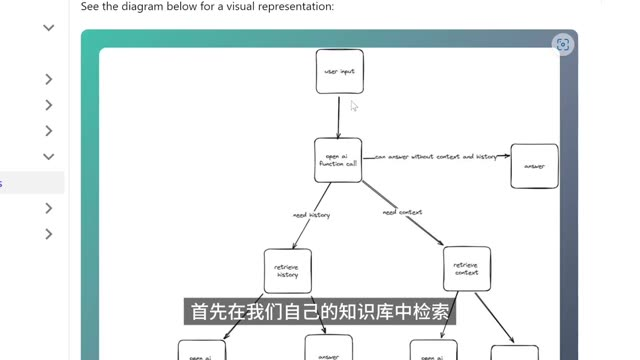

# Video Highlight Agent

基于**阿里云百炼 Coding Plan**（OpenAI 兼容协议 + `qwen3.6-plus` 视觉模型）的精华视频自动剪辑智能体（MVP）。

输入任意视频，自动完成：
1. 视频类型识别（演讲 / Vlog / 影视 / 教程 / 访谈 / 综合）
2. 按语义切片并对每段评分（信息密度、情绪强度、独立可观看性）
3. 按目标时长贪心筛选 + 主题去重 + 时间顺序重排
4. ffmpeg 无损切割与拼接，输出精华短视频

## 一、架构

```
video.mp4
  -> VideoIngestor  : ffprobe 探测元数据 + ffmpeg 均匀抽帧（默认 16 帧，可选 ASR 转写）
  -> VisionAnalyst  : 多帧 base64 喂给 qwen3.6-plus，单次推理产出结构化片段标注
  -> ContentCurator : 按 score + 目标时长 + 主题脉络筛选与排序
  -> VideoComposer  : ffmpeg 切片 + concat
  -> highlight.mp4 + highlight.json
```

> Coding Plan 当前**不提供视频原生输入**，因此采用「等距抽帧 → 多张图片传入」的方式做时空理解；未来 Coding Plan 若开放视频输入，只需替换 `tools/llm_client.py` 即可。

## 二、安装

### 1. 系统依赖
确保 `ffmpeg` 与 `ffprobe` 已在 PATH：
```bash
ffmpeg -version
ffprobe -version
```
Ubuntu：`sudo apt install ffmpeg`

### 2. Python 依赖
```bash
python -m venv .venv
source .venv/bin/activate
pip install -r requirements.txt
```

### 3. 配置 API Key
```bash
cp .env.example .env
# 编辑 .env，填入 CODING_API_KEY（套餐专属 sk-sp-... 开头的密钥）
```
获取 Key：阿里云百炼 Coding Plan 控制台 → 套餐专属 API Key → 复制。

> ⚠️ Coding Plan 的 Key **不能**用普通百炼 DashScope 端点，它有专属 base_url：`https://coding.dashscope.aliyuncs.com/v1`（已写在 `.env.example`）。

## 三、使用

### 端到端：生成精华短视频
```bash
python main.py run input.mp4 \
    --target 60 \
    --output highlight.mp4
```

可选参数：
- `--model plus` 视觉模型别名，默认 `plus` = `qwen3.6-plus`
  - 别名：`plus`(qwen3.6-plus) / `pro`(qwen3.5-plus) / `kimi`(kimi-k2.5)
  - 也可直接传完整模型名
- `--min-score 0.5` 片段最低保留分数
- `--target 60` 目标时长（秒）
- `--num-frames 16` 抽帧数量（多 = 更精准但更慢/贵）

### 仅分析（调试 prompt）
```bash
python main.py analyze input.mp4 --num-frames 24
```
输出 `workspace/output/<video>.analysis.json`，含视频类型、整体摘要与全部片段评分。

## 四、Coding Plan 可用模型清单

仅以下模型具备**视觉理解**能力（用于本项目）：

| 别名 | 完整名 | 说明 |
|---|---|---|
| `plus` | `qwen3.6-plus` | **默认**，性价比首选 |
| `pro`  | `qwen3.5-plus` | 失败回退 / 兜底 |
| `kimi` | `kimi-k2.5`    | 备选，长上下文擅长 |

`qwen3-max-2026-01-23` / `qwen3-coder-*` / `glm-5` / `glm-4.7` / `MiniMax-M2.5` **不支持视觉**，不能用于本项目。

## 五、ASR（语音识别）

Coding Plan 套餐**不含 ASR 模型**，所以默认 `ASR_PROVIDER=noop`（不转写，纯视觉分析）。

如果需要语音内容（演讲/访谈等强口播场景效果更好）：
1. 另开通普通百炼 DashScope Key（用于 `paraformer-v2`），填到 `ASR_API_KEY`
2. 把 `ASR_PROVIDER` 改成 `paraformer`
3. v0.2 会实现该 Provider（当前 `tools/asr.py` 已有抽象接口骨架）

## 六、目录结构

```
video-auto-edit-agent/
├── agents/                # 四个智能体（Ingestor/Analyst/Curator/Composer + Orchestrator）
├── tools/
│   ├── llm_client.py      # OpenAI 兼容 Coding Plan 客户端
│   ├── frame_extractor.py # ffmpeg 均匀抽帧 + base64
│   ├── ffmpeg_tools.py    # 切片 / 拼接 / probe
│   └── asr.py             # ASR Provider 抽象（NoopASR 默认）
├── prompts/               # 分析 prompt 模板（含 {FRAMES_HEADER} 占位符）
├── schemas.py             # pydantic 数据契约
├── config.py              # 配置加载
├── main.py                # CLI 入口
├── workspace/             # 运行时中间产物（git ignore）
└── tests/
```

## 七、冒烟测试建议

1. 准备一段 3-10 分钟的视频（演讲 / Vlog / Tutorial 都可）
2. 配置好 `.env` 中的 `CODING_API_KEY`
3. 运行：
   ```bash
   python main.py run sample.mp4 --target 45 --num-frames 16
   ```
4. 检查：
   - `workspace/output/sample_highlight.mp4` 应可正常播放
   - `workspace/output/sample_highlight.json` 含被选中的片段元信息

## 八、示例（Showcase）

拿一段 **5’23” 的 Quivr 本地知识库教程**（1280×720，21 MB）跑了一次全流程。



> 这一帧取自 Curator 挑中的精华片段（原视频 171–209s）。模型从这类架构图 + 字幕中提炼出“Quivr 如何检索与回答”这一核心价值点。

### 1. 调用命令
```bash
python main.py run input.mp4 \
    --target 30 \
    --min-score 0.9 \
    --num-frames 16 \
    --output workspace/output/quivr_highlight.mp4
```

### 2. 模型识别出的全视频所有片段（17 个）

```
video_type = tutorial    duration = 323.3s    segments = 17
摘要：本视频是一个关于如何使用开源工具 Quivr 搭建本地 ChatGPT 知识库的教程。视频详细演示了从购买 API Key、安装环境依赖 (Git, Docker)，到一键运行 Quivr 服务，再到上传本地文档（如 PDF）构建知识库并进行对话的全过程，最后还介绍了如何配置私有本地大模型。
```

| #  |  start |    end |  score | topic                   | tags         |
|----|--------|--------|--------|-------------------------|--------------|
| 1  |   0.0  |  19.0  |  0.60  | 视频开场与痛点引入          | 开场         |
| 2  |  19.0  |  38.0  |  0.80  | Quivr 项目介绍                | 知识点, 金句  |
| 3  |  38.0  |  57.0  |  0.70  | Quivr 核心功能展示            | 知识点       |
| 4  |  57.0  |  76.0  |  0.50  | 准备工作：API Key             | 知识点       |
| 5  |  76.0  |  95.0  |  0.60  | 环境安装：Git 与 Docker       | 知识点       |
| 6  |  95.0  | 114.0  |  0.80  | 一键运行 Quivr                | 高潮, 知识点  |
| 7  | 114.0  | 133.0  |  0.70  | 上传语料：文本与文件          | 知识点       |
| 8  | 133.0  | 152.0  |  0.60  | 上传示例 PDF                  | 案例         |
| 9  | 152.0  | 171.0  | **0.90** | **Quivr 工作原理图解**       | 知识点, 总结 |
| 10 | 171.0  | 190.0  |  0.70  | 无法找到语料时的处理        | 知识点       |
| 11 | 190.0  | 209.0  |  0.80  | 对话演示：杭州亚运会          | 案例, 高潮   |
| 12 | 209.0  | 228.0  |  0.60  | Prompt Engineer 进阶         | 知识点       |
| 13 | 228.0  | 247.0  |  0.70  | 模型配置与自定义              | 知识点       |
| 14 | 247.0  | 266.0  | **0.90** | **私有本地大模型 (Private LLM)** | 高潮, 知识点 |
| 15 | 266.0  | 285.0  |  0.70  | 本地模型部署方法              | 知识点       |
| 16 | 285.0  | 304.0  |  0.60  | 未来计划与总结                | 总结         |
| 17 | 304.0  | 323.3  |  0.50  | 结尾呼吁                    | 收尾         |

### 3. Curator 挑出的精华片段

```json
{
  "target_duration": 30,
  "total_duration": 38.0,
  "picks": [
    {
      "start": 171.0,
      "end": 209.0,
      "score": 0.9,
      "topic": "Private LLM 本地化部署",
      "summary": "介绍了 Private LLM 功能，允许用户将大语言模型下载到本地运行，保护数据隐私。",
      "reason": "这是 Quivr 的一大亮点（数据不出本地），对于关注隐私的用户极具吸引力，属于高价值信息。",
      "tags": ["知识点", "高潮"]
    }
  ]
}
```

### 4. 耗时与产出

| 阶段 | 耗时 |
|---|---|
| ffprobe + ffmpeg 抽 16 帧 | ~3s |
| qwen3.6-plus 多模态推理 | ~51s |
| Curator 筛选 + ffmpeg 拼接 | <1s |
| **总计** | **~55s** |

产出三件套：
```
workspace/output/
  quivr_highlight.mp4              # 1.6 MB 精华视频 (38s, 1280x720, h264+aac)
  quivr_highlight.analysis.json    # 4.0 KB 完整分析报告
  quivr_highlight.highlight.json   # 668 B  被选中的片段元信息
```

### 5. 观察

- **模型能读出 UI 语义**：Private LLM 这个亮点不是画面中的显著文字，是模型从设置面板 + 教程上下文推理出来的。
- **JSON Schema 严格命中**：17 个 segment 全部字段合法，未触发兜底。
- **局限**：由于未接 ASR，模型只能按抽帧均匀划分片段（每段 ≈ 19s）。v0.2 接入 paraformer-v2 后，切分粒度可精准到语义跳变点。

## 九、AI 解说重剪 (`narrate`, v0.3)

“片段拼接”在纯口播场景会出现**叙事断裂**（开场以后直接跳到高潮，中间桥梁没了）。`narrate` 子命令走另一条路：脱离原视频时间线，让 LLM 写一篇 30–90 秒的解说稿、CosyVoice-v2 逐句配音、抽帧加 Ken Burns 动效重拼画面。

### 1. 流水线

```
video.mp4
  -> VideoIngestor   抽 32 帧，走 VideoAnalysis（复用 v0.1）
  -> VisionAnalyst   产出 overall_summary + segments
  -> ScriptWriter    qwen3.6-plus 多模态写稿，输出 NarrationScript
  -> VoiceCaster     CosyVoice-v2 逐句合成 mp3 + ffprobe 取时长
  -> SceneBuilder    每句 frame_indices -> Ken Burns mp4，concat + mux 音轨
  -> narration.mp4 + narration.json
```

### 2. 前置：“普通百炼 Key”

CosyVoice-v2 走原生 `dashscope` SDK，**Coding Plan Key 不能调用 TTS**。需要在阿里云百炼控制台 → API-KEY 管理，另开一把“普通 Key”，填到 `.env`：

```bash
TTS_API_KEY=sk-xxxxxxxx           # 必填
TTS_MODEL=cosyvoice-v2            # 默认
TTS_VOICE=longwan_v2              # longwan_v2(温柔女) | longxiaochun_v2(标准女) | longshu_v2(沉稳男)
```

> 计费说明：CosyVoice-v2 按字符计费，60s 解说约 240 字，单次成本约 0.01 元。如果已经为 ASR 开过 Key，可以复用同一把（代码会自动 fallback 到 `ASR_API_KEY`）。

### 3. 调用命令

```bash
python main.py narrate input.mp4 \
    --target 60 \
    --tone casual \
    --voice longwan_v2 \
    --output workspace/output/narration.mp4
```

可选参数：

| 参数 | 默认 | 说明 |
|---|---|---|
| `--target` | 60 | 目标解说时长（秒）。模型按“4 字/秒”推算字数，实际该 ±10% |
| `--tone` | casual | `casual`(轻快口语) / `formal`(客观陈述) / `hype`(炸裂话术) |
| `--voice` | 读取 .env | CosyVoice 音色名 |
| `--num-frames` | **32** | narrate 默认 32（素材库更丰富），run 仍默认 16 |
| `--model` | plus | `plus` / `pro` / `kimi`，同时用于画面理解与脚本撰写 |

### 4. 产出示例

```
workspace/output/
  narration.mp4              # AI 解说短视频（1280x720@30fps + aac）
  narration.analysis.json    # 复用 VisionAnalyst 的原始分析
  narration.narration.json   # 脚本 + 逐句时长 + 画面绑定帧
```

### 5. 与 `run` 的差异

| | `run` (片段拼接版) | `narrate` (AI 解说版) |
|---|---|---|
| 画面 | 原视频高分片段 | 关键帧 + Ken Burns |
| 音轨 | 原视频原声 | CosyVoice-v2 AI 配音 |
| 时长控制 | 受限于足分片段 | 脚本驱动，可多句拼接到任意时长 |
| 依赖 | 仅 Coding Plan Key | Coding Plan Key + 普通百炼 Key |
| 适用 | “保留原生表达”、讲话/金句场景 | “需要完整叙事”、短视频/走量场景 |

### 6. 脚本严格约束（见 `prompts/write_script.md`）

- 叙事弧线四段齐备：钩子 5s + 是什么 10s + 亮点 30-50s + 行动呼吁 5s
- 每句 12-25 字（CosyVoice 在此区间最自然），pydantic 强制 ≤ 50 字
- 每句必须指定 1-2 帧，ScriptWriter 会裁错越界下标 + 去重
- 同一帧不要复用超过 2 次（避免画面单调）

### 7. 设计取舍

- **为什么抽 32 帧而不是 16？** 脚本可能需要 8–16 句话，每句 × 1–2 帧，抽帧不够会出现重复画面。
- **为什么不烧字幕？** v0.4 再加；当前依靠 TTS 口播表达。
- **为什么要完全覆盖原音不保留 BGM？** 原音轨与 AI 解说会互打；BGM 衬底放 v0.4。
- **为什么 ScriptWriter 用 0.7 而 VisionAnalyst 用 0.3？** 一个要创作多样性、一个要结构化稳定。

### 8. 限制与调优点

- TTS 请求是同步逐句的，10 句约 8–15s；如果需要几十句可考虑改并发
- Ken Burns 在 1280x720 + 60s + 10 张图大约 30s 渲染
- 模型返回的 `frame_indices` 偶尔会集中在开头几帧；可在 prompt 中加强“覆盖全时间线”约束

## 十、后续迭代（Roadmap）

- v0.2 接入 paraformer-v2 ASR Provider（含 OSS 上传 + 异步转写）
- 自动字幕烧录（ffmpeg subtitles）
- 节奏卡点与转场
- ~~LLM 解说稿 + TTS 配音重剪版~~ → **已于 v0.3 实现，见上节 narrate**
- 长视频 map-reduce 摘要（>30min）
- Web UI

## 十一、许可证

MIT
